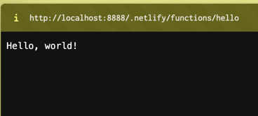
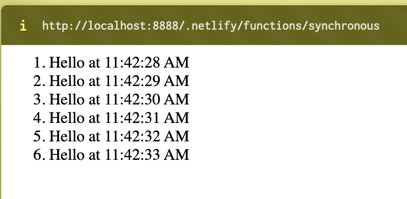
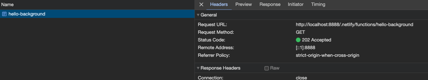
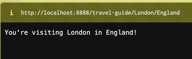

# Netlify functions examples

An example project using the examples from [the netlify functions docs](https://docs.netlify.com/functions/get-started/?fn-language=ts).

## Requirements

- Node v18.19+ (see `.nvmrc` file)

## Setup

```shell
$> yarn

```

## Usage

### Run locally

```shell
$> npx netlify dev
◈ Netlify Dev ◈
◈ Ignored general context env var: LANG (defined in process)
◈ No app server detected. Using simple static server
◈ Unable to determine public folder to serve files from. Using current working directory
◈ Setup a netlify.toml file with a [dev] section to specify your dev server settings.
◈ See docs at: https://cli.netlify.com/netlify-dev#project-detection
◈ Running static server from "netlify-functions"
◈ Setting up local development server

◈ Static server listening to 3999

   ┌─────────────────────────────────────────────────┐
   │                                                 │
   │   ◈ Server now ready on http://localhost:8888   │
   │                                                 │
   └─────────────────────────────────────────────────┘

⠋ Setting up the Edge Functions environment. This may take a couple of minutes.◈ Loaded function hello
✔ Setting up the Edge Functions environment. This may take a couple of minutes.
Request from ::1: GET /.netlify/functions/hello
Response with status 200 in 479 ms.
```

Open `http://localhost:8888/.netlify/functions/hello` in your browser to hit the hello endpoint.



## Structure

These functions use the `.mts` extension which allows use of ECMA modules in typescript without specifying the package
to be a `module` (via `package.json`). If `.ts` is preferred, then rename to `.ts` and add `"type": "module"` to the 
`package.json` file. 

Functions are defined within the `netlify-functions` directory. Once run using `npx netlify dev` these functions are
available via the `http://localhost:8888/.netlify/functions/<functionName>` url.   

## Available endpoints

### Hello

A simple hello world function.

http://localhost:8888/.netlify/functions/hello


### Synchronous

> A synchronous function lets you implement a traditional client/server interaction, where the connection is kept open 
> until the function execution is finished, allowing the client to wait for a response before rendering a page or moving on to the next task.

This examples returns a content every second up to a max of 5 seconds.

http://localhost:8888/.netlify/functions/synchronous



### Background

A background function is one that is meant for long-running tasks, e.g., creating a pdf. Long-running tasks always return 202.
Another function is to be used to work with the result of the long-running task.

> To define a background function, the name of the function needs to have a `-background` suffix (for example, 
> netlify/functions/hello-background.mts or netlify/functions/hello-background/index.mts).

http://localhost:8888/.netlify/functions/hello-background



### Specific paths

Instead of using the function name as the endpoint, netlify functions can be configured to use a specific path e.g 
`"/travel-guide/:city/:country"`

http://localhost:8888/travel-guide/London/England

